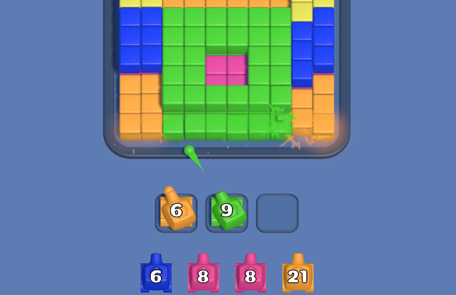
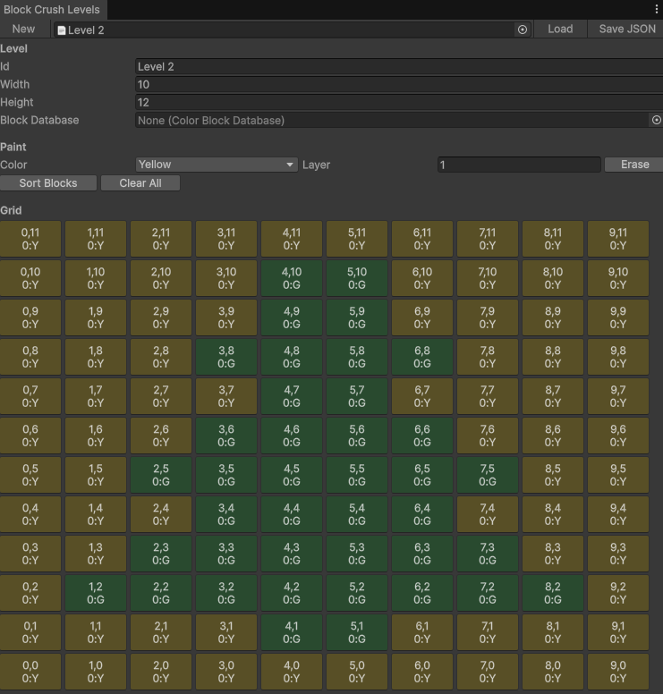
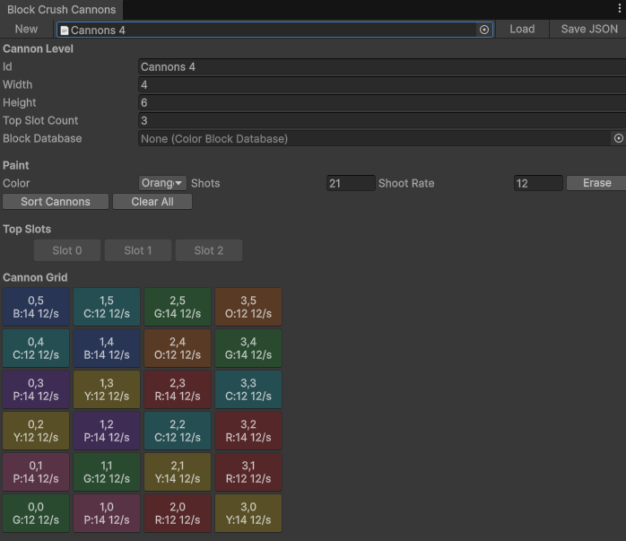

# Color Block Crush

## Gameplay Demo

<p align="center">
  
</p>

<p align="center">
  <a href="https://www.youtube.com/shorts/HuV__DcZoq0">
    Watch full gameplay video
  </a>
</p>

Unity implementation of a hyper-casual color block puzzle/shooter inspired by
`Color Block Crush`. The project was created as a test task and focuses on a
data-driven level setup, modular gameplay code, Zenject factories, DOTween
animations, and custom Unity editor tooling for level authoring.

## Development Time

Estimated implementation time: **28 hours**.

## License

This repository is **source-available, not open-source**. The original project
code and project materials are provided for review/evaluation only and may not
be used, copied, modified, distributed, or reused in another project without
prior written permission.

See [LICENSE](LICENSE) for the full terms. Third-party assets and plugins remain
governed by their own licenses and package terms.

## Project Overview

The game consists of two connected boards:

- **Block grid** - colored blocks are placed in cells and move from top to bottom
  when empty cells appear below them.
- **Cannon grid** - colored cannons move from bottom to top on their own grid.
  A cannon can be tapped when it is in the top/front row and can move into the
  first available top slot.
- **Top cannon slots** - centered slots above the cannon grid. Cannons shoot
  from these slots.
- **Shooting logic** - cannons shoot blocks of the same color. Targets are
  claimed before a bullet is fired, so several cannons can shoot in parallel
  without choosing the same block.
- **Win state** - all blocks are destroyed and no claimed shots are still
  pending.
- **Game over state** - all cannon slots are occupied and there is no valid
  target for the available cannon colors.

## Requirements

- Unity **6000.3.11f1**
- Universal Render Pipeline **17.3.0**
- C# / .NET support generated by Unity

Main scene:

```text
Assets/Game/Scenes/Game.unity
```

Project context:

```text
Assets/Resources/ProjectContext.prefab
```

## Technologies And Packages

The gameplay code uses:

- **Unity 6** for runtime, editor tooling, prefabs, scenes, UI and particles.
- **URP** for rendering.
- **Zenject** for dependency injection, installers and prefab factories.
- **DOTween** for movement, destroy, shake, UI and aiming animations.
- **UniTask** for async gameplay flows. Coroutines and regular Tasks are not
  used for gameplay sequencing.
- **TextMesh Pro** for cannon shot counters and UI text.
- **Unity UI / UGUI** for game over and level completed screens.
- **Unity Input System** is present in the project setup.
- **Odin Inspector** is included as a project tool dependency.

## Gameplay Details

### Blocks

Blocks are created through Zenject factories and configured from
`ColorBlockDatabase`.

Important behavior:

- A cell can contain several blocks stacked by layer.
- Block positioning inside a cell is controlled by the cell.
- Block height is exposed and used for stacking.
- Destroy animation is played through DOTween.
- Neighboring blocks can receive a small shake when a nearby block is destroyed.
- Destroy effects are spawned through a pooled particle effect system.
- Optional sound and haptic feedback are triggered on block destruction.

### Block Grid

The block grid has a bottom-center pivot: the first row starts from the grid
root and rows continue upward. Blocks settle downward by columns when there are
empty cells below them.

The grid keeps runtime state separate from visuals:

- cells know their grid position;
- cells own the stack of blocks inside them;
- grid movement is arranged as async DOTween/UniTask operations;
- active block count is tracked for win-state checks.

### Cannons

Cannons are also created through Zenject factories and are configured from
cannon JSON data.

Important behavior:

- Cannons move upward automatically on their grid.
- Cannons move into top slots only when tapped.
- A cannon can move to a slot only when it is in the top/front row and is not
  blocked by another cannon in front of it.
- Slots are reserved immediately when a cannon starts moving into them. This
  allows fast consecutive taps without waiting for the previous cannon movement
  to finish.
- Each cannon has configurable `shots` and `shootRate`.
- Current shot count is displayed with TextMesh Pro above the cannon.
- Cannons smoothly rotate toward the block they are shooting.
- If no valid target exists, the cannon smoothly returns to its forward
  rotation.
- When a cannon runs out of shots it disappears with an animation.

### Shooting And Target Selection

Shooting is dynamic and does not rely on physics collisions:

- bullets are spawned through a Zenject factory;
- bullet color matches cannon color;
- bullet flight is animated from the cannon muzzle to the target block;
- a hit is considered successful when the bullet reaches the target position;
- block destruction starts after bullet impact;
- targets are claimed before shooting, so parallel cannons do not pick the same
  block;
- if a cell contains several blocks, the top block is targeted first;
- cannons scan reachable targets by row priority and left-to-right order;
- a cannon continues through the current reachable row before moving to the next
  row, even if new blocks fall into earlier cells while it is already progressing
  across that row.

## Level JSON

Levels are data-driven. Block layouts and cannon layouts are stored in separate
JSON files under:

```text
Assets/Game/Data/Levels
```

Example files:

```text
Assets/Game/Data/Levels/Level 1.json
Assets/Game/Data/Levels/Cannons 1.json
```

Coordinates are counted from the **bottom-left corner** of each grid.

### Block Level Format

```json
{
  "id": "Level 1",
  "width": 10,
  "height": 12,
  "blocks": [
    {
      "x": 0,
      "y": 0,
      "layer": 0,
      "color": 3
    }
  ]
}
```

Fields:

- `x`, `y` - cell coordinate.
- `layer` - block stack layer inside the cell. This allows multiple blocks in
  one cell.
- `color` - `BlockColorKey` enum value.

Current color keys:

```text
Red = 0
Green = 1
Blue = 2
Yellow = 3
Orange = 4
Purple = 5
Cyan = 6
Pink = 7
```

### Cannon Level Format

```json
{
  "id": "Cannons 1",
  "width": 3,
  "height": 1,
  "slotCount": 3,
  "cannons": [
    {
      "x": 0,
      "y": 0,
      "color": 3,
      "shots": 40,
      "shootRate": 12.0
    }
  ]
}
```

Fields:

- `width`, `height` - size of the cannon grid.
- `slotCount` - number of centered top slots.
- `x`, `y` - cannon start coordinate.
- `color` - `BlockColorKey` enum value.
- `shots` - how many bullets this cannon can fire.
- `shootRate` - shots per second.

## Level Editor Tools

The project includes custom Unity editor windows for authoring JSON files.

### Block Level Editor

Menu path:

```text
Tools/Block Crush/Level JSON Editor
```

<p align="center">
  
</p>

Features:

- create a new block level;
- load an existing JSON text asset;
- edit level width and height;
- select paint color from `BlockColorKey`;
- paint blocks into grid cells;
- select stack layer for cells with multiple blocks;
- erase blocks;
- sort block entries;
- save JSON back to disk.

### Cannon Level Editor

Menu path:

```text
Tools/Block Crush/Cannon JSON Editor
```

<p align="center">
  
</p>

Features:

- create a new cannon layout;
- load an existing JSON text asset;
- edit cannon grid width and height;
- edit top slot count;
- select cannon color;
- configure shot count;
- configure shoot rate;
- paint and erase cannons;
- preview centered top slots;
- sort cannon entries;
- save JSON back to disk.

## Architecture

Gameplay code is placed under:

```text
Assets/Game/Scripts
```

The structure follows a module-oriented layout. Modules keep their own runtime
classes, `Shared` contracts/data, `Factory` classes and `Binding` installers
where appropriate.

```text
Assets/Game/Scripts
├── Binding
├── Block
│   ├── Factory
│   └── Shared
├── Cannon
│   ├── Factory
│   └── Shared
├── Data
│   ├── GameData
│   └── UserData
├── Effects
│   └── Factory
├── GameState
│   └── Shared
├── Grid
│   ├── Factory
│   └── Shared
├── Haptics
│   ├── Binding
│   ├── Data
│   └── Shared
├── Level
│   └── Shared
├── LevelManagement
│   ├── Binding
│   └── Shared
├── Sound
│   ├── Binding
│   ├── Data
│   └── Shared
└── UI
    ├── GameOver
    └── LevelCompleted
```

### Main Modules

- **Binding** - composition root. `GameInstaller` binds gameplay factories,
  grids, parsers, effect pooling and game state services.
- **Grid** - block board, cells, stack positioning and downward movement.
- **Block** - block visuals, color definitions, block animation and block
  factory.
- **Cannon** - cannon grid, cells, top slots, cannons, bullets, targeting and
  factories.
- **Effects** - block destroy particle effect controller, pool and spawner.
- **Level** - JSON contracts, parsers and scene bootstrapper.
- **LevelManagement** - level progression and scene reload logic.
- **GameState** - win/game-over detection and result event flow.
- **UI.GameOver / UI.LevelCompleted** - result screens, button actions and
  cascade show animations.
- **Sound** - sound database, sound player and sound installer.
- **Haptics** - haptic settings, player and installer.
- **Data.GameData** - ScriptableObject databases for levels and sounds.
- **Data.UserData** - persistent user data for completed levels/current level.

### Dependency Injection

Zenject is used for:

- scene-level installers;
- project-level installers;
- block, cell, cannon, slot, bullet and effect factories;
- service bindings such as level management, game state, sound and haptics.

Objects that are spawned at runtime are created through factories instead of
direct `Instantiate` calls in gameplay logic.

### Async And Animation

DOTween is used for visual movement and feedback:

- block falling;
- block stack settling;
- block destruction;
- neighbor shake;
- cannon movement;
- cannon aiming;
- cannon shooting;
- bullet flight;
- cannon disappear;
- result UI cascade animation.

Gameplay animation flows are awaited with UniTask. The helper
`TweenUniTaskBridge` converts DOTween completion/cancel events into UniTask
flows while respecting cancellation tokens.

### Effects Pooling

Block destruction particles are spawned through:

```text
BlockDestroyEffectSpawner
BlockDestroyEffectPool
BlockDestroyEffectFactory
```

The effect controller receives the block color before play. It updates particle
color over lifetime while preserving the alpha values configured in the prefab.

### Level Progression

`LevelManager` controls the next level and reloads the same scene with a new
setup:

1. Level 1 runs once.
2. Level 2 runs once.
3. Levels 3-5 run in order.
4. After all levels 3-5 are completed, the next level is randomized from levels
   3-5.

Game over restarts the current level. Level completed marks the current level as
completed and reloads the scene for the next selected level.

## Important Data Assets

```text
Assets/Game/Data/ColorBlockDatabase.asset
Assets/Game/Data/BlockCrushAnimationSettings.asset
Assets/Game/Data/LevelDatabase.asset
Assets/Game/Data/SoundDatabase.asset
Assets/EditorData/UserData/LevelsUserData.json
```

## Third-Party Assets And Plugins

The project uses the following third-party packages/assets:

| Asset / Plugin | Location | Usage |
| --- | --- | --- |
| Zenject | `Assets/Plugins/Zenject` | Dependency injection, installers and factories |
| DOTween / Demigiant | `Assets/Plugins/Demigiant` | Runtime tween animations |
| Odin Inspector / Sirenix | `Assets/Plugins/Sirenix` | Inspector/editor tooling support |
| UniTask | `Packages/manifest.json` Git dependency | Async gameplay flows |
| TextMesh Pro | `Assets/TextMesh Pro` | UI text and cannon shot counters |
| Toony Colors Pro 2 | `Assets/JMO Assets/Toony Colors Pro` | Toon shaders/material style |
| Epic Toon FX | `Assets/Epic Toon FX` | Imported VFX package |
| MOST Haptic Feedback | `Assets/MOST_HapticFeedback` | Haptic feedback integration |
| Hyper Casual FX | `Assets/Lana Studio/Hyper Casual FX` | Imported hyper-casual VFX package |
| Coiny Regular font | `Assets/Game/Fonts/Coiny-Regular.ttf` | Game UI font |
| Unity URP | `Packages/manifest.json` | Rendering pipeline |
| Unity Input System | `Packages/manifest.json` | Input package included in project setup |
| Unity UI / UGUI | `Packages/manifest.json` | Result screens and buttons |

Third-party assets retain their original licenses and package terms.

## Running The Project

1. Open the project in Unity **6000.3.11f1**.
2. Open the scene:

   ```text
   Assets/Game/Scenes/Game.unity
   ```

3. Ensure `ProjectContext` exists at:

   ```text
   Assets/Resources/ProjectContext.prefab
   ```

4. Enter Play Mode.

## Notes

- All gameplay scripts are under `Assets/Game/Scripts`.
- Level content is JSON-driven and can be edited either manually or through the
  custom Unity editor windows.
- Runtime-spawned gameplay objects are created through Zenject factories.
- Gameplay sequencing uses UniTask instead of coroutines.
- Physics collisions are not used for bullet hits; bullet arrival is determined
  by the animated flight reaching its target.
